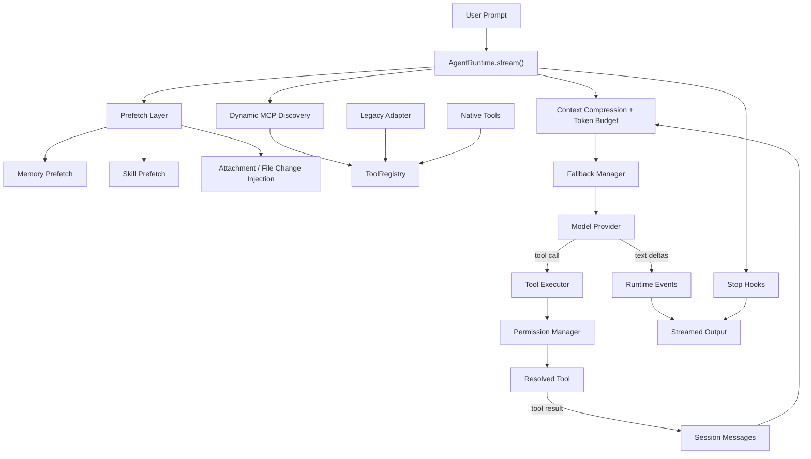
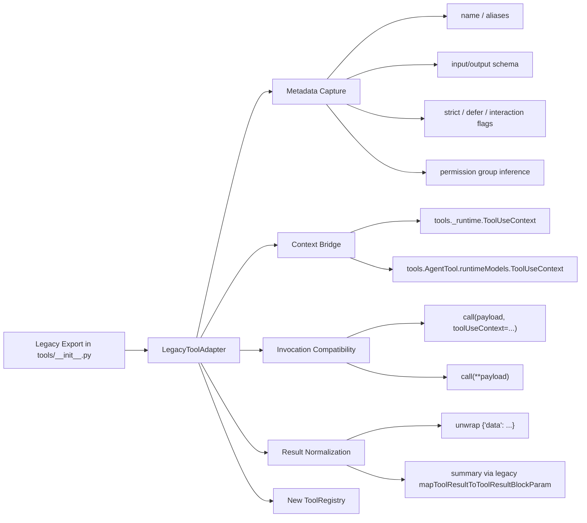

# Agent Runtime Architecture

## Overview

This project now has two layers:

1. A new orchestration layer in `agent_runtime/`
2. A legacy tool corpus in `tools/`, mounted into the new runtime through an adapter

## Package Map

```text
D:/code_project/python_port/
  agent_runtime/
    config.py                  # runtime policy, model policy, feature toggles
    schemas.py                 # messages, tool calls, tool results, session state
    events.py                  # streaming runtime events
    errors.py                  # runtime/provider/tool exceptions
    providers/
      base.py                  # model provider abstraction
      mock_provider.py         # mock streaming/tool-calling model
      openai_compatible.py     # real OpenAI-compatible chat-completions provider
    tools/
      base.py                  # new runtime tool contract
      registry.py              # tool registry + alias resolution
      permissions.py           # coarse permission groups
      legacy_adapter.py        # bridge from old tools/ into new ToolRegistry
      builtin_*.py             # small native example tools
    runtime/
      engine.py                # main loop orchestration
      budget.py                # token estimates and prompt budget checks
      compression.py           # fold/compress context without breaking tool results
      fallback.py              # model fallback chain
      interruption.py          # user interruption control
      hooks.py                 # stop-hook pipeline
      attachments.py           # attachment and file-change injection
      memory.py                # memory prefetch
      skills.py                # skill prefetch/discovery
      mcp.py                   # dynamic MCP tool discovery
      telemetry.py             # jsonl logging and spans
  tools/                       # legacy mirrored Claude-style tools
  examples/
    run_basic_agent.py         # minimal end-to-end demo
```

## Runtime Flow



## Legacy Tool Bridge



## Module Responsibilities

- `agent_runtime/runtime/engine.py`
  Owns the main loop, multi-turn execution, model fallback, continuation after max output, tool dispatch, telemetry emission, and final stop hooks.

- `agent_runtime/providers/openai_compatible.py`
  Calls real model APIs through an OpenAI-compatible Chat Completions interface, including streaming text and tool-call parsing.

- `agent_runtime/runtime/compression.py`
  Folds long messages and compresses older context while preserving tool-result messages as lossless records.

- `agent_runtime/runtime/budget.py`
  Estimates prompt token load and decides when compression is needed.

- `agent_runtime/runtime/fallback.py`
  Produces the ordered provider chain from primary model to fallback models.

- `agent_runtime/runtime/interruption.py`
  Holds interruption state and raises `UserInterruptedError` when the run should stop.

- `agent_runtime/runtime/attachments.py`
  Injects attachment previews and file-change notifications into the system context.

- `agent_runtime/runtime/memory.py`
  Prefetches reusable memory notes relevant to the current user request.

- `agent_runtime/runtime/skills.py`
  Prefetches skill references that may help the current request.

- `agent_runtime/runtime/mcp.py`
  Accepts dynamic MCP client factories and turns discovered tools into runtime tools.

- `agent_runtime/runtime/telemetry.py`
  Writes JSONL events and performance spans for later debugging and analysis.

- `agent_runtime/tools/registry.py`
  Stores tools by canonical name and alias, and exposes the tool schemas to providers.

- `agent_runtime/tools/permissions.py`
  Enforces coarse runtime permission groups before a tool executes.

- `agent_runtime/tools/legacy_adapter.py`
  Adapts the old `tools/` package into the new runtime contract.

- `tools/`
  Remains the legacy implementation layer for file, shell, search, task, team, MCP, and agent tools.

## Current Tool Adaptation Scope

All top-level exports from `tools.__all__` that expose a `call()` method are now registered into the new `ToolRegistry`.

- Registered legacy tools: `Agent`, `AskUserQuestion`, `Bash`, `Brief`, `Config`, `CronCreate`, `CronDelete`, `CronList`, `Edit`, `EnterPlanMode`, `EnterWorktree`, `ExitPlanMode`, `ExitWorktree`, `Glob`, `Grep`, `LSP`, `ListMcpResources`, `MCP`, `McpAuth`, `NotebookEdit`, `PowerShell`, `Read`, `ReadMcpResource`, `RemoteTrigger`, `SendMessage`, `Skill`, `Sleep`, `SyntheticOutput`, `TaskCreate`, `TaskGet`, `TaskList`, `TaskOutput`, `TaskStop`, `TaskUpdate`, `TeamCreate`, `TeamDelete`, `TodoWrite`, `ToolSearch`, `WebFetch`, `WebSearch`, `Write`

- Native runtime demo tools: `echo`, `glob_search`, `read_file`

## Notes

- Legacy tools that return `behavior="ask"` are translated by the adapter. Coarse-grained groups such as `exec`, `state`, `interactive`, `agent`, `automation`, `lookup`, and `mcp` are treated as approved by the new runtime policy layer once their group is enabled. Read/write path-bound asks are still blocked unless the legacy tool itself resolves them as allowed.
- `AgentTool` is adapted through a dedicated context bridge because it uses a different legacy runtime model package than the rest of the tools.
